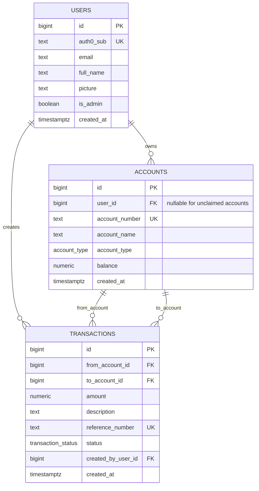
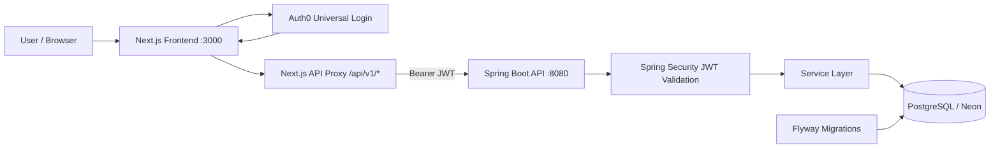
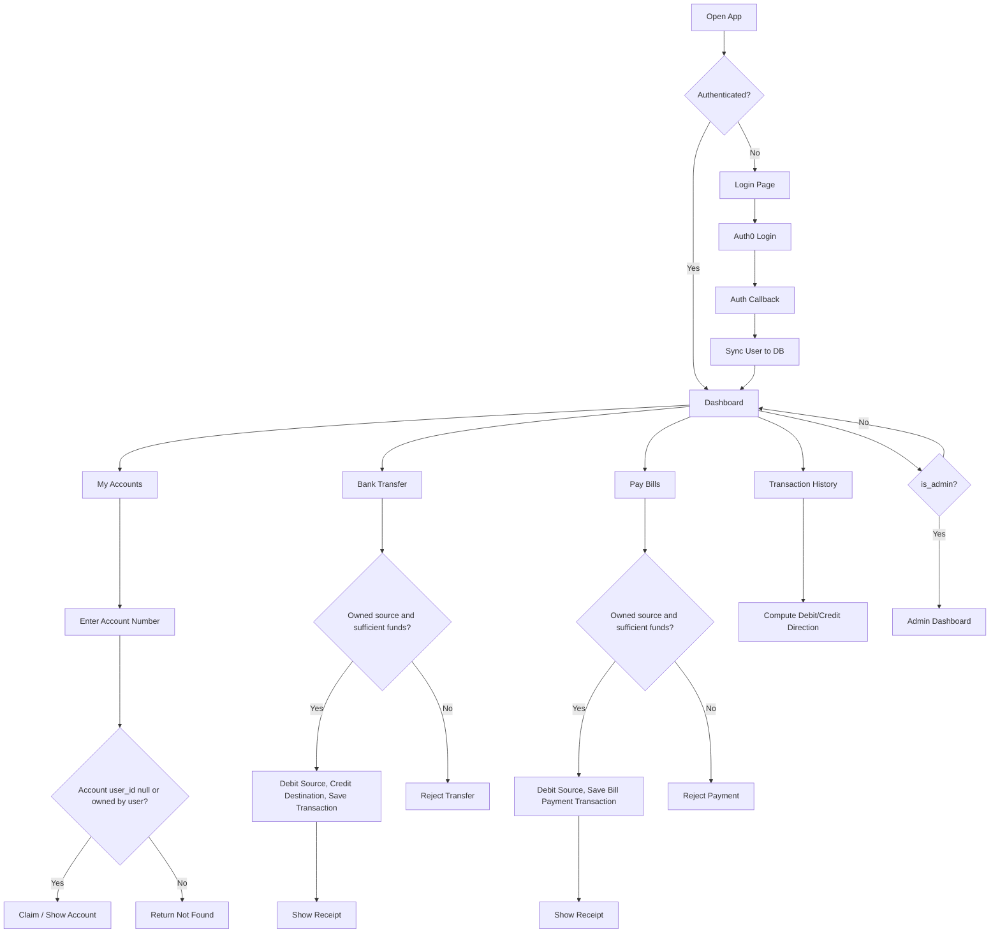

# Nova Bank Diagram Context

This document contains the context needed to create three diagrams for Nova Bank:

- Database diagram / ERD
- System flow diagram
- Architecture diagram

Nova Bank is a secure banking web app with a Next.js frontend, Spring Boot backend, Auth0 authentication, and PostgreSQL database.

## 1. System Summary

Nova Bank lets authenticated users:

- Sign in with Auth0.
- Sync their Auth0 profile into the local `users` table.
- Claim an unassigned bank account by entering an account number.
- View only accounts they own.
- Transfer money between accounts.
- Pay bills from an owned account.
- View transaction history with debit/credit direction.
- Generate receipts for transfers and bill payments.
- Access an admin dashboard if their local database user has `is_admin = true`.

The system uses Auth0 for identity, but application authorization and admin status are controlled by the Nova Bank database.

## 2. High-Level Architecture

Main components:

- Browser client
- Next.js frontend
- Auth0 Universal Login
- Next.js API proxy routes
- Spring Boot REST API
- Spring Security OAuth2 Resource Server
- PostgreSQL database
- Flyway database migrations

Architecture flow:

```text
Browser
  -> Next.js app pages
  -> Auth0 login/logout/callback routes
  -> Next.js API proxy routes under /api/v1/*
  -> Spring Boot API under /api/v1/*
  -> PostgreSQL via Spring Data JPA
```

Auth flow:

```text
Browser
  -> /auth/login
  -> Auth0 Universal Login
  -> /auth/callback
  -> frontend/lib/auth0.ts onCallback
  -> POST backend /api/v1/users/me
  -> users row created/updated
  -> redirect to /dashboard
```

Runtime topology:

```text
Browser
  | HTTPS/HTTP
  v
Next.js frontend :3000
  | Bearer JWT from Auth0 access token
  v
Spring Boot backend :8080
  | JDBC
  v
PostgreSQL / Neon

External:
Auth0 tenant validates identity and issues JWTs.
```

## 3. Technology Stack

Frontend:

- Next.js 16 App Router
- React 19
- Auth0 Next.js SDK: `@auth0/nextjs-auth0`
- API proxy routes in `frontend/app/api/v1/*`

Backend:

- Spring Boot 3
- Java 21
- Spring Security OAuth2 Resource Server
- Spring Data JPA / Hibernate
- Flyway migrations
- PostgreSQL JDBC

Database:

- PostgreSQL 17 locally through Docker
- Neon PostgreSQL for hosted database

Infrastructure:

- `frontend/compose.yml` runs frontend, backend, and PostgreSQL locally.
- Frontend container runs on port `3000`.
- Backend container runs on port `8080`.
- PostgreSQL is bound locally to `127.0.0.1:5432`.

## 4. Important Source Files

Frontend:

- `frontend/app/layout.tsx` - wraps app with Auth0 provider.
- `frontend/proxy.ts` - Auth0 middleware; excludes `/api/v1/*`.
- `frontend/lib/auth0.ts` - Auth0 client and user sync callback.
- `frontend/components/sidebar.tsx` - main authenticated navigation.
- `frontend/app/dashboard/page.tsx` - dashboard.
- `frontend/app/bank-accounts/page.tsx` - account lookup/claim page.
- `frontend/components/AccountNumberLookup.tsx` - account claiming UI.
- `frontend/app/bank-transfer/page.tsx` - transfer flow.
- `frontend/app/pay-bills/page.tsx` - bill payment flow.
- `frontend/app/e-statement/page.tsx` - statement/history.
- `frontend/app/smart-spend/page.tsx` - spending analytics.
- `frontend/app/admin/page.tsx` - admin dashboard.
- `frontend/app/api/v1/*` - frontend API proxy routes.

Backend:

- `backend/src/main/resources/application.yml` - Spring configuration.
- `backend/src/main/resources/db/migration/V1__init_schema.sql` - base DB schema.
- `backend/src/main/resources/db/migration/V2__seed_demo_data.sql` - demo seed data.
- `backend/src/main/resources/db/migration/V3__add_admin_flag.sql` - admin flag.
- `backend/src/main/java/com/novabank/config/SecurityConfig.java` - backend security.
- `backend/src/main/java/com/novabank/config/JwtToUserConverter.java` - DB-backed admin role.
- `backend/src/main/java/com/novabank/entity/User.java` - user entity.
- `backend/src/main/java/com/novabank/entity/Account.java` - account entity.
- `backend/src/main/java/com/novabank/entity/Transaction.java` - transaction entity.
- `backend/src/main/java/com/novabank/controller/*Controller.java` - REST endpoints.
- `backend/src/main/java/com/novabank/service/*Service.java` - business logic.
- `backend/src/main/java/com/novabank/repository/*Repository.java` - database queries.

## 5. Database Diagram Context

### Core Tables

`users`

- Purpose: stores the local application profile for an Auth0 identity.
- Primary key: `id`.
- Unique identity field: `auth0_sub`.
- Admin authorization field: `is_admin`.

Columns:

| Column | Type | Notes |
| --- | --- | --- |
| `id` | `BIGSERIAL` | Primary key |
| `auth0_sub` | `TEXT` | Unique, not null; maps to Auth0 JWT `sub` |
| `email` | `TEXT` | Synced from Auth0 |
| `full_name` | `TEXT` | Synced from Auth0 |
| `picture` | `TEXT` | Synced from Auth0 |
| `created_at` | `TIMESTAMPTZ` | Default `NOW()` |
| `is_admin` | `BOOLEAN` | Default `false`; added in `V3__add_admin_flag.sql` |

`accounts`

- Purpose: stores bank accounts.
- Primary key: `id`.
- Ownership: `user_id` points to `users.id`.
- Account claiming requirement: an account may be unassigned with `user_id = NULL`, then claimed by a user.

Columns:

| Column | Type | Notes |
| --- | --- | --- |
| `id` | `BIGSERIAL` | Primary key |
| `user_id` | `BIGINT` | FK to `users.id`; must be nullable for unclaimed account flow |
| `account_number` | `TEXT` | Unique public account identifier |
| `account_name` | `TEXT` | Display name |
| `account_type` | `account_type` enum | `SAVINGS`, `CURRENT`, `FIXED_DEPOSIT` |
| `balance` | `NUMERIC(14,2)` | Check `balance >= 0` |
| `created_at` | `TIMESTAMPTZ` | Default `NOW()` |

Important note for DB diagram:

- `V1__init_schema.sql` defines `accounts.user_id NOT NULL`.
- Current application flow requires unclaimed accounts with `user_id = NULL`.
- Therefore, the deployed database must include an alteration equivalent to:

```sql
ALTER TABLE accounts ALTER COLUMN user_id DROP NOT NULL;
```

`transactions`

- Purpose: stores transfers and bill payments.
- Primary key: `id`.
- A transfer has both `from_account_id` and `to_account_id`.
- A bill payment has `from_account_id` and usually `to_account_id = NULL`.
- `created_by_user_id` stores the user who initiated the transaction.

Columns:

| Column | Type | Notes |
| --- | --- | --- |
| `id` | `BIGSERIAL` | Primary key |
| `from_account_id` | `BIGINT` | FK to `accounts.id`, nullable |
| `to_account_id` | `BIGINT` | FK to `accounts.id`, nullable |
| `amount` | `NUMERIC(14,2)` | Check `amount > 0` |
| `description` | `TEXT` | Transfer description or bill payment description |
| `reference_number` | `TEXT` | Unique receipt/reference number |
| `status` | `transaction_status` enum | `SUCCESS`, `FAILED`, `PENDING` |
| `created_by_user_id` | `BIGINT` | FK to `users.id`, nullable |
| `created_at` | `TIMESTAMPTZ` | Default `NOW()` |

### Database Relationships

```text
users.id 1 ---- 0..N accounts.user_id

users.id 1 ---- 0..N transactions.created_by_user_id

accounts.id 1 ---- 0..N transactions.from_account_id

accounts.id 1 ---- 0..N transactions.to_account_id
```

Relationship notes:

- A user may have zero accounts immediately after signup.
- A user only sees claimed accounts.
- An unclaimed account has `accounts.user_id = NULL`.
- A transfer affects two accounts.
- A bill payment affects one account and has no internal destination account.
- Admin status is not a separate role table; it is a boolean on `users`.

### Suggested ERD Mermaid



## 6. Backend API Context

Public endpoints:

| Method | Endpoint | Purpose |
| --- | --- | --- |
| `GET` | `/api/health` | Health check |
| `GET` | `/actuator/health` | Spring actuator health |

Authenticated user endpoints:

| Method | Endpoint | Controller | Purpose |
| --- | --- | --- | --- |
| `GET` | `/api/v1/users/me` | `UserController` | Return current user profile |
| `POST` | `/api/v1/users/me` | `UserController` | Create/update local user from Auth0 JWT/profile |
| `GET` | `/api/v1/accounts` | `AccountController` | Return accounts owned by authenticated user |
| `GET` | `/api/v1/accounts/lookup?accountNumber=...` | `AccountController` | Claim or return an account by number |
| `GET` | `/api/v1/accounts/{accountId}` | `AccountController` | Return one owned account |
| `POST` | `/api/v1/transfers` | `TransferController` | Execute an atomic transfer |
| `POST` | `/api/v1/bill-payments` | `BillPaymentController` | Pay a bill and return a receipt |
| `GET` | `/api/v1/transactions` | `TransactionController` | Paginated user transaction history |

Admin endpoints:

| Method | Endpoint | Controller | Purpose |
| --- | --- | --- | --- |
| `GET` | `/api/v1/admin/stats` | `AdminController` | Platform KPIs |
| `GET` | `/api/v1/admin/users` | `AdminController` | All users with account summaries |
| `GET` | `/api/v1/admin/transactions` | `AdminController` | Platform transaction history |

Security:

- `/api/health` and `/actuator/health` are public.
- `/api/v1/**` requires a valid Auth0 JWT.
- `/api/v1/admin/**` requires `ROLE_admin`.
- Spring does not use server-side sessions; it is stateless.
- `JwtToUserConverter` reads `users.is_admin` and grants `ROLE_admin`.

## 7. Frontend API Proxy Context

The frontend has proxy routes under `frontend/app/api/v1/*`.

These routes:

- Get the Auth0 access token from the Next.js Auth0 SDK.
- Attach `Authorization: Bearer <token>`.
- Forward the request to the Spring Boot backend.
- Keep browser-facing calls same-origin.

Proxy route mapping:

| Next.js route | Backend target | Method |
| --- | --- | --- |
| `/api/v1/users` | `/api/v1/users/me` | `GET`, `POST` |
| `/api/v1/accounts` | `/api/v1/accounts` | `GET` |
| `/api/v1/accounts/lookup` | `/api/v1/accounts/lookup` | `GET` |
| `/api/v1/transfers` | `/api/v1/transfers` | `POST` |
| `/api/v1/bill-payments` | `/api/v1/bill-payments` | `POST` |
| `/api/v1/transactions` | `/api/v1/transactions` | `GET` |
| `/api/v1/admin` | `/api/v1/admin/{endpoint}` | `GET` |

Important frontend middleware detail:

- `frontend/proxy.ts` applies Auth0 middleware to app routes.
- It excludes `/api/v1/*`, static assets, and image assets.
- This lets API proxy routes execute normally.

## 8. System Flow Diagram Context

### Flow A: Login and Local User Sync

Actors:

- User
- Browser
- Next.js frontend
- Auth0
- Spring Boot backend
- PostgreSQL

Steps:

1. User opens Nova Bank.
2. Unauthenticated user is redirected to `/login`.
3. User clicks sign in.
4. Browser navigates to `/auth/login`.
5. Next.js Auth0 SDK redirects to Auth0 Universal Login.
6. User authenticates with Auth0.
7. Auth0 redirects back to `/auth/callback`.
8. `frontend/lib/auth0.ts` runs `onCallback`.
9. `onCallback` sends `POST /api/v1/users/me` to backend with the Auth0 access token.
10. Backend validates JWT issuer and audience.
11. `UserService.upsertFromJwt` creates or updates the `users` row by `auth0_sub`.
12. User is redirected to `/dashboard`.

Diagram notes:

- The JWT `sub` maps to `users.auth0_sub`.
- No bank account is automatically created during signup.
- User profile sync is separate from account claiming.

### Flow B: Account Claiming

Actors:

- Authenticated user
- Next.js `AccountNumberLookup`
- Next.js API proxy
- Spring Boot `AccountService`
- PostgreSQL

Steps:

1. User goes to `/bank-accounts`.
2. User enters an account number in format `ACC-xxxxxxxxxx`.
3. Frontend calls `/api/v1/accounts/lookup?accountNumber=...`.
4. Next proxy attaches Bearer token and calls backend.
5. Backend validates account number format with `^ACC-[1-9]{10}$`.
6. Backend resolves the current user from JWT.
7. Backend finds account by `account_number`.
8. If `user_id IS NULL`, backend assigns the account to the current user.
9. If already owned by the same user, backend returns it.
10. If owned by another user, backend returns not found to avoid account existence leaks.
11. Frontend displays only that claimed account.

Diagram notes:

- This is the only intended user-facing account assignment flow.
- The page should never show another user's account.
- The system deliberately returns 404-style responses for unauthorized account access to prevent IDOR leaks.

### Flow C: Bank Transfer

Actors:

- Authenticated user
- Next.js transfer page
- Next.js API proxy
- Spring Boot `TransferService`
- PostgreSQL

Steps:

1. User opens `/bank-transfer`.
2. Frontend loads owned accounts from `/api/v1/accounts`.
3. User selects source account, enters destination account, amount, and description.
4. Frontend calls `POST /api/v1/transfers`.
5. Backend resolves user from JWT.
6. Backend verifies source account belongs to current user.
7. Backend looks up destination account by account number.
8. Backend blocks self-transfer.
9. Backend blocks zero/negative amount.
10. Backend checks sufficient funds.
11. Within one database transaction:
    - Debit source account.
    - Credit destination account.
    - Insert row into `transactions`.
12. Backend returns `TransferResponseDTO` with receipt/reference data.
13. Frontend displays transfer receipt and updated balance.

Reference format:

- Transfer reference numbers use prefix `NB-`.

Critical invariants:

- Source account must be owned by current user.
- Amount must be positive.
- Balance must be sufficient.
- Transfer must be atomic.
- A failed transfer should not partially debit or credit either account.

### Flow D: Bill Payment

Actors:

- Authenticated user
- Next.js bill payment page
- Next.js API proxy
- Spring Boot `BillPaymentService`
- PostgreSQL

Steps:

1. User opens `/pay-bills`.
2. Frontend displays biller list from frontend constants.
3. Frontend loads owned accounts from `/api/v1/accounts`.
4. User selects biller, source account, customer reference, and amount.
5. Frontend calls `POST /api/v1/bill-payments`.
6. Backend resolves user from JWT.
7. Backend verifies source account ownership.
8. Backend checks sufficient funds.
9. Within one database transaction:
    - Debit source account.
    - Insert transaction with `from_account_id`.
    - Leave `to_account_id` null because billers are not internal bank accounts.
10. Backend returns `PaymentReceiptDTO`.
11. Frontend displays bill payment receipt.

Reference format:

- Bill payment reference numbers use prefix `BP-`.

Critical invariants:

- Source account must be owned by current user.
- Amount must be positive through DTO validation.
- Balance must be sufficient.
- Bill payment is debit-only from the bank account perspective.

### Flow E: Transaction History and Direction

Actors:

- Authenticated user
- Next.js dashboard/e-statement/smart-spend pages
- Spring Boot `TransactionService`
- PostgreSQL

Steps:

1. Page requests `/api/v1/transactions`.
2. Backend resolves user from JWT.
3. Backend loads accounts owned by current user.
4. Backend queries transactions where:
    - `from_account_id` is one of the user's accounts, or
    - `to_account_id` is one of the user's accounts.
5. Backend computes direction:
    - `CREDIT` if `to_account_id` belongs to the user.
    - `DEBIT` otherwise.
6. Frontend displays:
    - Credit as `+amount`, green up icon.
    - Debit as `-amount`, red down icon.

Diagram notes:

- Transfers can appear as either debit or credit depending on the user's side.
- Bill payments are always debits for the paying user because `to_account_id` is null.

### Flow F: Admin Authorization and Dashboard

Actors:

- Admin user
- Next.js admin page
- Spring Security
- `JwtToUserConverter`
- PostgreSQL

Steps:

1. User authenticates normally with Auth0.
2. Backend validates JWT.
3. `JwtToUserConverter` finds local `users` row by `auth0_sub`.
4. If `users.is_admin = true`, converter grants `ROLE_admin`.
5. Admin page checks `/api/v1/users/me`.
6. If not admin, frontend redirects to `/dashboard`.
7. Admin page fetches:
    - `/api/v1/admin/stats`
    - `/api/v1/admin/users`
    - `/api/v1/admin/transactions`
8. Backend enforces admin access at:
    - Security filter chain
    - `@PreAuthorize("hasRole('admin')")`

Admin promotion SQL:

```sql
UPDATE users SET is_admin = true WHERE email = 'admin@example.com';
```

## 9. Suggested Architecture Diagram Nodes

Use these nodes:

- User / Browser
- Next.js frontend
  - App routes
  - Auth0 SDK
  - API proxy routes
- Auth0
  - Universal Login
  - JWT issuer
- Spring Boot backend
  - Controllers
  - Services
  - Spring Security
  - JWT decoder
  - `JwtToUserConverter`
- PostgreSQL / Neon
  - `users`
  - `accounts`
  - `transactions`
- Flyway
  - Applies migrations at backend startup

Suggested architecture Mermaid:



## 10. Suggested System Flow Diagram Nodes

For a system flow diagram, show these groups:

- Entry and authentication:
  - `/login`
  - `/auth/login`
  - Auth0 Universal Login
  - `/auth/callback`
  - `POST /api/v1/users/me`

- User banking:
  - `/bank-accounts`
  - Account lookup and claim
  - `/bank-transfer`
  - Transfer validation
  - `/pay-bills`
  - Bill payment validation
  - Transaction receipt

- Reporting:
  - `/dashboard`
  - `/e-statement`
  - `/smart-spend`
  - `/api/v1/transactions`

- Admin:
  - `/admin`
  - `users.is_admin`
  - `/api/v1/admin/*`

Suggested high-level flow:



## 11. Data Direction Rules

Use these rules in diagrams and labels:

- Transfer sent from a user's account: debit.
- Transfer received into a user's account: credit.
- Bill payment from a user's account: debit.
- Transaction direction is not stored directly in the database; it is computed by the backend response based on account ownership.
- Receipts are response DTOs generated after transaction persistence; reference numbers are stored in `transactions.reference_number`.

## 12. Security and Trust Boundaries

Trust boundaries to show:

1. Browser to Auth0:
   - User credentials are handled by Auth0, not Nova Bank.

2. Browser to Next.js:
   - Next.js manages Auth0 session and protected routes.

3. Next.js to Spring Boot:
   - API calls carry Auth0 Bearer JWT.
   - Next.js proxy routes prevent exposing backend details directly in client calls.

4. Spring Boot to PostgreSQL:
   - Backend performs all financial validation and persistence.
   - Frontend validation is only UX; backend is source of truth.

5. Admin authorization:
   - Auth0 authenticates identity.
   - Nova Bank database authorizes admin status through `users.is_admin`.

## 13. Main DTOs for Diagram Labels

Transfer request:

- `fromAccountId`
- `toAccountNumber`
- `amount`
- `description`

Transfer response / receipt:

- `transactionId`
- `referenceNumber`
- `amount`
- `fromAccountNumber`
- `toAccountNumber`
- `newBalance`
- `timestamp`

Bill payment request:

- `fromAccountId`
- `billerId`
- `billerName`
- `customerReference`
- `amount`

Bill payment receipt:

- `transactionId`
- `referenceNumber`
- `type`
- `status`
- `amount`
- `fromAccountNumber`
- `payeeName`
- `customerReference`
- `description`
- `newBalance`
- `timestamp`

Transaction response:

- `id`
- `fromAccountNumber`
- `toAccountNumber`
- `amount`
- `description`
- `referenceNumber`
- `status`
- `direction`
- `createdAt`

## 14. Important Design Decisions

- Auth0 is used for authentication only.
- Auth0 paid RBAC is not required.
- Admin authorization is database-backed with `users.is_admin`.
- New users do not automatically get bank accounts.
- Users claim existing unassigned accounts by account number.
- All money movement happens in Spring service methods annotated with `@Transactional`.
- Account ownership checks prevent IDOR.
- Unauthorized account access returns not found to avoid leaking account existence.
- Sufficient funds checks are enforced before debits.
- Transaction history is scoped to accounts owned by the authenticated user.
- Frontend pages only display data returned from secure backend endpoints.

## 15. Diagram Creation Checklist

For the ERD:

- Include `users`, `accounts`, and `transactions`.
- Show `users.auth0_sub` as unique.
- Show `accounts.account_number` as unique.
- Show `transactions.reference_number` as unique.
- Show `accounts.user_id` as nullable for account claiming.
- Show two separate account relationships to transactions: source and destination.

For the architecture diagram:

- Show Auth0 as external identity provider.
- Show Next.js as frontend and API proxy.
- Show Spring Boot as backend API and business logic owner.
- Show PostgreSQL as persistence layer.
- Show JWT flowing from Auth0/Next.js to backend.
- Show Flyway applying migrations to PostgreSQL.

For the system flow diagram:

- Include login and local user sync.
- Include account claiming.
- Include transfer with validation and transaction persistence.
- Include bill payment with debit-only transaction.
- Include transaction direction calculation.
- Include admin role lookup from database.

